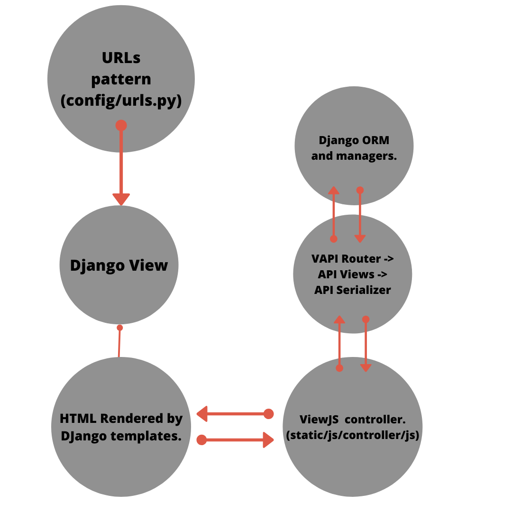

# Welcome to invoice maker.

Generate invoices with preloaded products.
You can check it out here: http://137.184.20.67/

#### Set it up in local for development.
1. Go to the project base folder.
2. Run docker-compose up --build
3. It's working :D

#### Set it up in production.
1. Go to the project base folder.
2. You've got to export COMPOSE_FILE as production.yml 
 in your envionment. (export COMPOSE_FILE=production.yml)
3. Configure .env file (check .env_example) with your db, postgres and django credentials.
4. If you wanted to use a dockerized db you can create it with
 db container.
5. Run docker-compose up --build -d
6. Run docker-compose exec app python manage.py collectstatic
7. Run docker-compose exec app pythom manage.py migrate

#### Test project.
Test files are in each application within apps/{app_name}/tests.py
1. You can test just by running docker-compose run app python manage.py test

#### General Arquitecture
This solution is using Python with Django for 
backend and VewJS (rendered by Django Templates)
and an API to connect both parts.

##### Django arquitecture.
- config/: Django configuration, with settings and wsgi and awsgi interfaces.
- apps/: Django applications and utils.
- templates/: Templates with Django templates.
- static/: Static files.

##### Another files.
- docker-compose.yml: Default docker conf for local.
- production.yml: Docker configuration for production.
- compose/: Docker images and compose files.
- .env_example: .env example file for production.

#### Flowchart
There are to main flowcharts in this application, the 
first one is about how to render UI with ViewJS and the second one
is about how ViewJS use the API.

